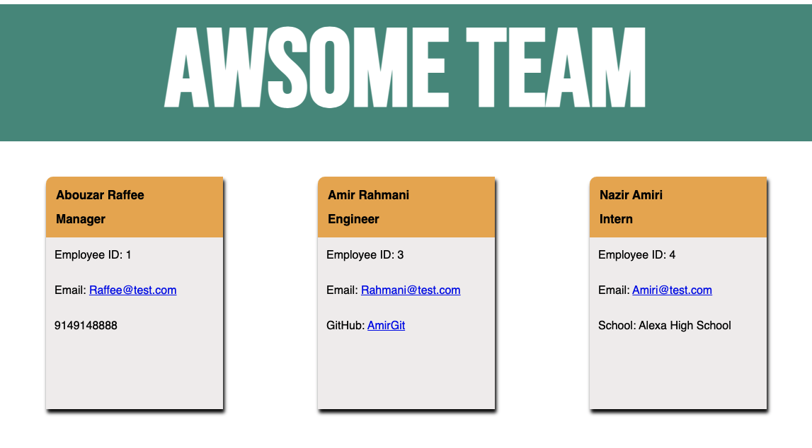
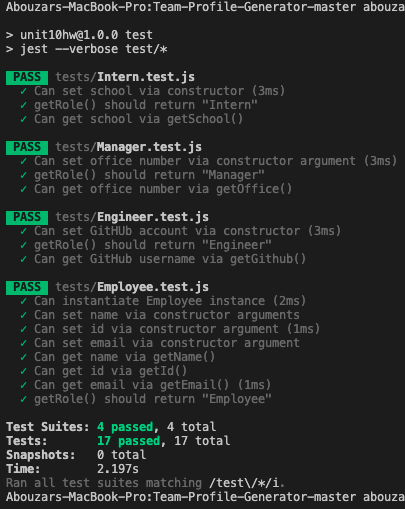

# Team-Profile-Generator

## Description 
This program will generate a profile HTML page after all the information for employees is provided via node command-line application.

## Images
Demonstration GIF:

A generated HTML page:

## Testing
This program is build using class syntax and constructor functions. The function for each employee type was tested before building out the rest of the program. 

## Installation 
Go to terminal and do the following commands. 

* `npm i` to install all necesarry modules. 

* `node app.js` to run the application. 

## License

